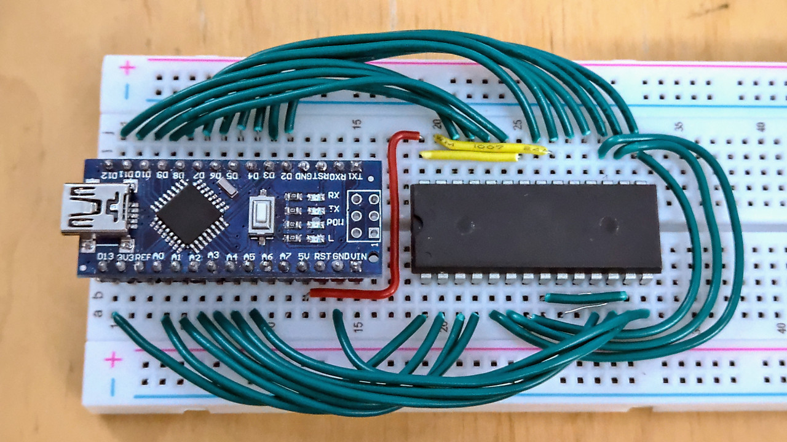
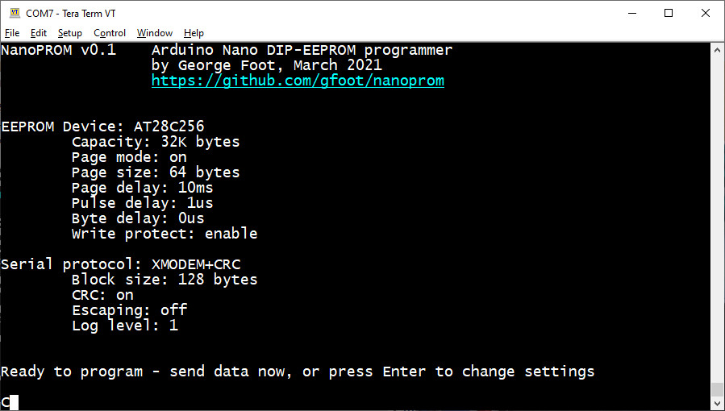

NanoPROM - DIP-EEPROM Programmer for Arduino Nano
=================================================

Writes ROM images to parallel-interface EEPROMs via XMODEM file transfer over USB.

|  | |  |
|:----:|----|:----:|
| Nano connected to EEPROM | | Terminal screenshot |

In particular compared to other similar programmers, this one works without requiring 
any additional components - just the Nano and the EEPROM, wired together correctly.

Features
--------

* No additional components are required - just the Arduino Nano and the EEPROM
* XMODEM+CRC transfer protocol makes it easy to send files to be written to the EEPROM
* Fast operation - slightly slower than the TL866 or my Pico version, but faster than a lot of other programmers
* Supports paged writes as well as byte-writes
* Supports write protection

Not features
------------
* Reading back and verifying is not supported won't ever be - the Nano on its own doesn't have enough GPIO pins for this
* YMODEM, ZMODEM, and other XMODEM extensions aren't supported yet

Installation
------------
1. Load the sketch in the Arduino IDE
2. Upload it to your Nano as usual

Usage
-----
1. Disconnect the Arduino Nano from power/USB
2. Wire the Arduino Nano up to the EEPROM according to the pinout table below
3. Connect the Arduino Nano to the computer by USB
4. Launch a terminal app with XMODEM support, such as Tera Term, and connect it to the Arduino Nano
   * Baud rate: 115200 (unless you change it in nanoprom.cpp)
   * New Line Receive option: LF or Auto
5. Hit Enter to let the Nano know you're connected and you should see an information screen
6. Check the settings, and if you need to change any then hit Enter and follow the prompts.
   * Press 'p' to return to programming mode when you're done
7. To program the EEPROM, just initiate an XMODEM+CRC transfer using your terminal app
8. Disconnect power before removing the EEPROM from the circuit

Pinout
------
The pinout is quite straightforward - the pins are laid out around the Nano in almost 
the same arrangement that they appear on the EEPROM, to make it easy and tidy to wire up.

Before you begin, connect the following pairs of pins together on the EEPROM:

**Make sure OE is connected high, to VCC, as allowing it to float low could cause damage to your Nano.**

| Function 1 | EEPROM pin 1 | EEPROM pin 2 | Function 2 |
| ---------- |:------------:|:------------:| ---------- |
|    VCC     |      28      |      22      |     OE     | 
|    GND     |      14      |      27      |     WE     |
|     A0     |      10      |      11      |     D0     |
|     A1     |       9      |      12      |     D1     |
|     A2     |       8      |      13      |     D2     |
|     A3     |       7      |      14      |     D3     |
|     A4     |       6      |      15      |     D4     |
|     A5     |       5      |      16      |     D5     |

Then make the following connections between the Nano and the EEPROM - better done with the power off:

| Nano pin | EEPROM pin | Function |      | Nano pin | EEPROM pin | Function |
| -------- |:----------:| -------- | ---- | -------- |:----------:| -------- |
| D13      | 1  | A14    | | 5V       | 28 | VCC    |
| A0       | 2  | A12    | |          | 27 | WE     |
| A1       | 3  | A7     | | D12      | 26 | A13    |
| A2       | 4  | A6     | | D11      | 25 | A8     |
|          | 5  | A5     | | D10      | 24 | A9     |
|          | 6  | A4     | | D9       | 23 | A11    |
|          | 7  | A3     | |          | 22 | OE     |
|          | 8  | A2     | | D8       | 21 | A10    |
|          | 9  | A1     | | D7       | 20 | CE     |
|          | 10 | A0     | | D6       | 19 | D7     |
| A3       | 11 | D0     | | D5       | 18 | D6     |
| A4       | 12 | D1     | | D4       | 17 | D5     |
| A5       | 13 | D2     | | D3       | 16 | D4     |
| GND      | 14 | GND    | | D2       | 15 | D3     |

The pins missing from this table should already be connected to other EEPROM pins as noted above.

### Other options

Depending upon preference, you could swap the CE and WE connections, or connect
them both to the Nano's D7.  It doesn't make any difference to the programming
operation, I just chose this layout because it seemed most convenient to me.

